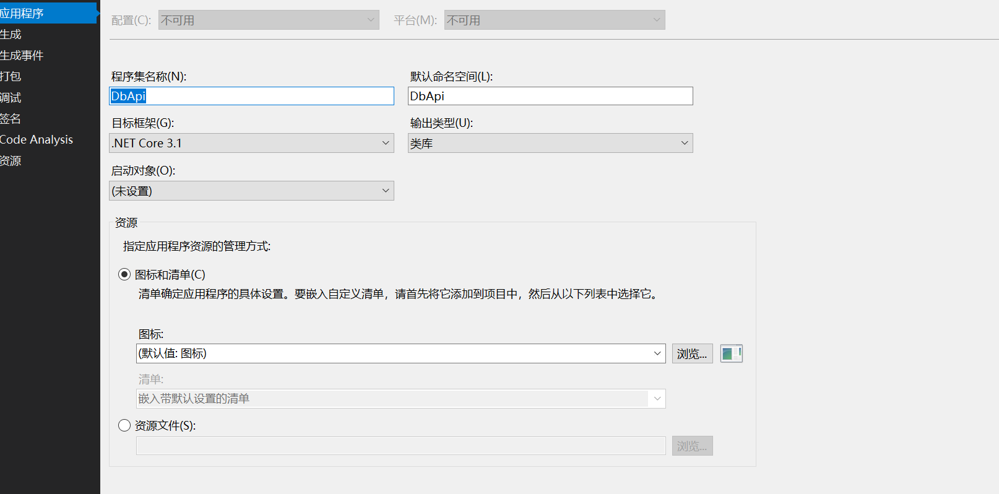
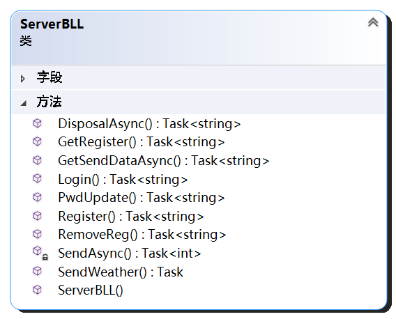

**天气预报系统项目总结** 


<!-- 强行分页 -->
<!-- 目录 -->
<div STYLE="page-break-after: always;"></div>

<span style="font-size:50px"> 

**目录** 

</span>

[toc]

<div STYLE="page-break-after: always;"></div>

<!-- 正文 -->
# 项目要求

本次项目共提供5个选题，本人选择了第一个项目，也就是天气预报系统，其要求如下:  

请用**观察者模式**设计一套天气预报系统，该程序由两部分组成：天气预报信息**服务器端**和天气预报信息**展示端**。下面给出这两部分分别要实现的详细功能说明：
 - 天气预报信息服务器端：
该程序主要包括以下几个方面的功能：
  - 天气信息的采集（可以从某个网页上爬取真实的天气信息）；
  - 定时往所有注册过的天气预报信息展示端发送相应的天气信息；
  - 采集到的天气信息和展示端的注册信息保存在数据库中，用于存储天气信息和展示端的注册信息的数据表请自行设计，有关数据库的访问接口要求打包在一个**动态链接库**中，供服务端程序调用，数据库可选择Access或者SQL Server...。
 - 天气预报信息展示端（可以设计多个）：

该程序主要包括以下几个方面的功能：
- 随时接收服务端发来的天气信息并实时显示；
- 可往服务端发送注册天气信息预定和取消天气信息预定的请求；

提示：服务端和展示端之间的通信可以自行选择，例如：可以采用UDP方式，展示端通过注册消息将本机IP发往服务端进行注册。


## 需求分析
从上述要求可以看出主要内容如下:  

1. 使用观察者模式构建系统(包含观察者订阅以及消息广播两个部分)
2. 需要把数据库接口打包成dll

本项目全程使用C#构建系统，C#提供许多强大的功能，方便进行数据库访问以及链接库打包以及异步编程

# 服务端设计

服务端设计本项目是花时间最长的部分，也是代码量最多的，主要包括两部分内容：  
1. 数据接口层(DLL)
2. 业务逻辑层(BLL)

## 数据接口层

数据接口层使用的是C# orm框架entity framework core([官方文档](https://docs.microsoft.com/zh-cn/ef/core/))。
在visual studio中的NuGet管理器安装以下包，这些包用于构建数据库接口  

<div align="center">


</div>


该框架可以方便地进行数据库迁移，利用以下包可以直接通过数据库生成对应的Model  
<div align="center">


</div>

### 数据库设计

本项目使用的是database first的方法构建数据库，使用的数据库是MySql，在NuGet控制台中运行以下命令即可得到数据模型对应的代码  
```ps1
Scaffold-DbContext 'server={yourserver ip};uid={your database userid};pwd={your password};database={your database}' Pomelo.EntityFrameworkCore.MySql -Outputdir Model -force
```

在mysql中，构建了三个数据表

---

- 天气表(用于记录城市/市区的天气)  

- 用户表(记录用户ip地址以及用户名和密码)

- 记录表(记录用户订阅的地点)  


<div align="center">

数据库ER图
 
</div>
---

#### 本项目观察者模式最底层的实现

三个表中的RecordTable就是用来记录订阅信息的，利用关联查询，可以利用usertable记录的信息得到订阅者的ip，然后进行消息推送，观察者的订阅以及取消订阅都是处理这个表，这个表是本项目中观察者模式底层的实现

### 数据接口DbApi

数据接口的源代码位于DbApi文件夹下，提供同步接口以及异步接口(项目中主要使用异步接口)

<div align="center">


DbApi,后缀为Async的方法为异步方法
</div>


`DbApi.cs`中打包了一些项目中常用的接口，把一些sql查询封装成接口，接口输入参数大部分都是使用json格式的字符串格式，保持了接口的统一，例如下面这个接口就包含了异步编程、linq查询以及json序列化等方法在内  
<div align="center">


</div>


### 数据接口打包成dll

C#中打包成dll方法有很多，可以直接运行后复制dll文件，但是由于数据接口`DbApi`本身还依赖了其它包的dll，所以最好的方法还是使用visual studio的打包功能，具体步骤如下:  

- 确定项目配置，要求.NET版本以及cpu架构对应(默认是MSIL，也就是any cpu)，这里使用默认的配置，点击下图选项即可打包得到一个nupkg(把本代码的dll以及依赖项dll打包)  
- 确保项目把没用到的依赖去除，保证.csproj文件映射正确
- 重新调整依赖项后，最好清空NuGet缓存再打包


<div align="center">


  
项目属性
</div>
<div align="center">


打包
</div>

出错点在于，不要把没用到的包也放进来打包，否则很容易出现依赖映射出问题，如果打包前需要重置，最好的方法是先把bin/和obj/文件夹删掉，并且把**NuGet缓存清空**，再进行打包，这样能确保更新后的配置正确地打包进nupkg文件  

数据库接口打包后得到以下文件  
<div align="center">


DbApi.dll就是我的数据库接口
</div>
在vs2019中使用NuGet包管理器直接安装这个包就可以把数据库接口及其依赖项都引入到项目当中  

## 业务逻辑层

业务逻辑层主要包括了以下内容：  

1. 爬取天气信息
2. 数据更新后推动数据给用户
3. 定时更新与推送
4. 处理用户提交的请求

以上三个内容都要使用到数据接口，同时相互之间又有一定的依赖关系，并且有些功能类如果重复创建会出现冲突的情况，为了方便管理功能之间的依赖关系，使用**依赖注入**的方法来管理。  

依赖注入用我自己的理解来说就是把依赖的实例化放到本类之外，在本类中留下依赖的一个引用，这样就可以使用到依赖的功能同时减少实例的创建。

在本项目中使用到了C#的一个IoC容器`Autofac`([官方文档](https://autofaccn.readthedocs.io/zh/latest/))进行管理，只需要在创建相应的功能后对功能进行登记就可以运行`build`方法就可以完成依赖注入，非常方便。以下就是我在项目中的使用例子  

```csharp
var cb = new ContainerBuilder();
//数据接口层
cb.RegisterType<DbApi.DbApi>()
    .AsSelf();
    //.SingleInstance();
//数据更新
cb.RegisterType<WeatherUpdater>()
    .Named<IUpdater>("weatherUpdater")
    .SingleInstance();
cb.RegisterType<WeatherGetter>()
    .AsSelf()
    .SingleInstance();
//服务逻辑
cb.RegisterType<ServerBLL>()   //需要新增命令时，在这个类中增加服务实例,
    .AsSelf()
    .SingleInstance();
cb.RegisterType<LoginDisposal>() //登陆处理
    .AsSelf()
    .SingleInstance();
cb.RegisterType<SendDisposal>()  //推送处理
    .AsSelf()
    .SingleInstance();
cb.RegisterType<RegisterDisposal>()  //订阅处理
    .AsSelf()
    .SingleInstance();
cb.RegisterType<PasswordDisposal>()  //修改密码
    .AsSelf()
    .SingleInstance();
cb.RegisterType<GetRegisterDisposal>() //获取用户订阅
    .AsSelf()
    .SingleInstance();
cb.RegisterType<RemoveRegDisposal>() //删除记录
    .AsSelf()
    .SingleInstance();
```

### 天气信息爬取  

<div align="center">


WeatherGetter类图
</div>

天气信息爬取我使用的是高德地图天气api([高德地图天气api使用文档](https://lbs.amap.com/api/webservice/guide/api/weatherinfo/?sug_index=3))的信息，服务端将会定时访问该api，获得数据存入数据库用于天气预报推送。这部分代码位于UDPserver/Moudule/DataGetter.cs中。
其过程大致如下:

1. 查看数据库中预设了哪些地点
2. 向天气apihttps://restapi.amap.com/v3/weather/weatherInfo发送请求，获得每个地点的实时天气以及明后4天的天气
3. 存入天气表

### 天气信息推送

推送服务使用的是UDP的通信方式，UDP通信可以方便地实现数据广播，并且创建连接的开销比TCP小

<div align="center">



ServerBLL类图
</div>


天气推送功能集成在了`UDPserver\Disposal\SendDisposal.cs.cs`文件中，该文件为`ServerBLL.cs`提供获取推送数据的功能，然后通过`ServerBLL.cs`中提供的UDPClient进行发送  

所设计的函数如下

<div align="center">


</div>

### 定时更新与推送(观察者模式中的广播)

<div align="center">


Updater类图
</div>


该定时功能运行逻辑位于`\UDPserver\Module\Updater.cs`,执行步骤大致如下  

1. 爬取天气信息，进行数据更新
2. 获取用户订阅地点的天气，按照用户ip推送数据

这样就完成了观察者模式当中"一旦被观察者发送改变就通知观察者"的功能

### 用户请求处理

<div align="center">


类图(由于使用的是依赖注入的方法，这里自动生成的图中没有画出来)
</div>

这部分功能集成在了`UDPserver\Module\ServerBLL.cs`及其依赖`UDPserver\Disposal`(不同的请求处理对应`Disposal`下不同的文件)中，所有的用户请求都使用三个字母作为前缀，加上json格式的请求信息发送到服务端。

当服务端的ServerBLL接收到内容后先解析请求信息头，确定服务类型，然后将后续的json信息传入对应的处理方法(Disposal)中进行处理

各种请求或推送格式如下所示:  

```json
// 登录
LOG{
    "username":"user",      //必选，用户名，并且用户名是唯一标识
    "ip":"127.0.0.1:8899", //必选，默认Ip为0.0.0.0:8899
    "password":"123456" //必选，默认密码为123
}
// 订阅
REG{
    "username":"user",
    "password":"123456",
    "ip":"127.0.0.1:8899",
    "sites":["110000","110105"] //内容为高德地图的adcode
}
// 修改密码
PWD{
    "username":"user", //必选，用户名
    "password":"123", //必选，当前用户密码
    "ip":"127.0.0.1:8899", //必选
    "new":"12345" //必选，新的密码 
}
// 删除订阅
DER{
    "username":"user", //必选，用户名
    "password":"123", //必选，当前用户密码
    "ip":"127.0.0.1:8899", //必选
    "sites":["110000","110105"] //内容为高德地图的adcode
}
// 查看订阅
GRE{
    "username":"user",
    "password":"123456",
    "ip":"127.0.0.1:8899",
}
// 推送
WEA{
  //天气信息，参考高德地图天气api字段
}
```

每个请求如果成功操作都会回传一个"SUC"+{请求选项eg. LOG}的字段，客户端可以自行选择是否接收这个数据


## 服务端运行逻辑

服务端启动的时候会开启两个线程：  
1. 持续监听用户信息的线程，当接收到用户请求后，送入`ServerBLL`进行解析，然后执行相应的用户处理线程，该步骤是异步的，所以响应速度很快
2. 定时刷新数据线程，刷新数据会做两个动作:  
   1. 向高德地图api发送天气信息请求
   2. 更新WeatherTable相应数据行


# 客户端设计

本项目的客户端设计成终端式的客户端，代码位于`ConsoleClient`文件夹下运行逻辑如下:  

<div align="center">


运行逻辑
</div>

其中订阅操作相当于观察者模式当中的订阅，该操作发送订阅信息到服务端中，服务端再向数据库中的RecordTable加入一行，表示**加入了观察者**，由此完成了整个基于观察者模式的天气预报推送系统和客户端

# 总结

本项目使用的编程模式是简单的三层模式，展示层，业务逻辑层以及数据接口层，全程使用C#作为编程语言，在使用同时，学会了很多有用的编程知识，比如异步编程方法，C#提供方便的语法糖，帮助开发人员高效进行异步编程，方便管理多线程;学会了利用依赖注入，管理程序之间的依赖关系，降低程序之间的耦合程度，方便扩展功能；学会了如何利用观察者模式管理多对一的系统。由于时间的关系，在展示端没有使用Gui，而是使用了终端。虽然较为简陋，但基本上体现了本项目的基本功能。本项目可优化的地方还有很多，比如展示端可以变得更美观，服务端可以提供更多的命令等等。这些内容后续将进一步优化。

# 附录(运行效果图)

## 服务端启动示例
<div align="center">


服务端启动立即进行监听，同时开始第一次天气信息更新
</div>

<div align="center">


服务端推送数据到客户端
</div>


## 客户端
进入客户端后会自动抽取本地未被占用端口与127.0.0.1组成套接字
此处以两个用户为例，进行效果展示  

```
{username:lxc1,password:123,ip:127.0.0.1:8000}
{username:lxc2,password:123,ip:127.0.0.1:8001}
```
**登录界面**
<div align="center">


</div>


**按C键，查看两个用户已有订阅**  
<div align="center">


</div>

**按R键，为两个用户分别订阅两个地点**  
<div align="center">


订阅成功

按tab返回后按R键返回查看结果
</div>

**按D键，可以退订**  

<div align="center">


lxc1用户退订同安区

退订成功
</div>

**按esc键，开始实时接收天气更新信息**  

<div align="center">

  

lxc1用户所得信息


</div>

<div align="center">


lxc2用户所得信息

</div>


## 项目配置

**建立数据库**  

在Dbapi下有一个sql文件`createDatabase.sql`，该文件可以在mysql数据库中建立本项目的数据库`weathersys`

**配置UDPserver**  
`UDPserver`需要对数据库的连接地址进行配置，本项目开发时用的时远程数据库，本质上和本地数据库是一样的，可以在`UDPserver\App.config`中设置对应的字段  

如下所示:  


**配置ConsoleClient**  
`ConsoleClient`下也有一个`App.Config`文件，具体含义如下  


项目均在Windows系统下开发，推荐使用visual studio进行项目生成  

